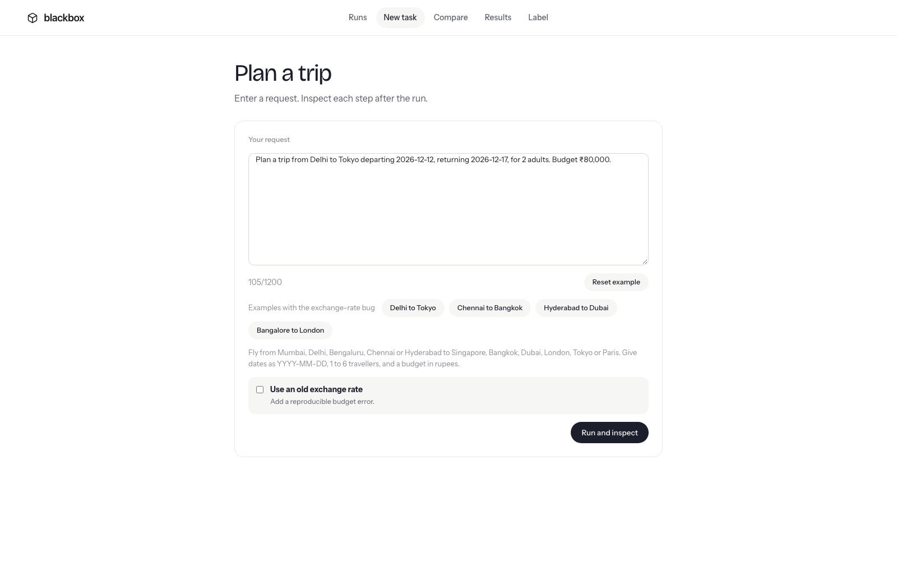
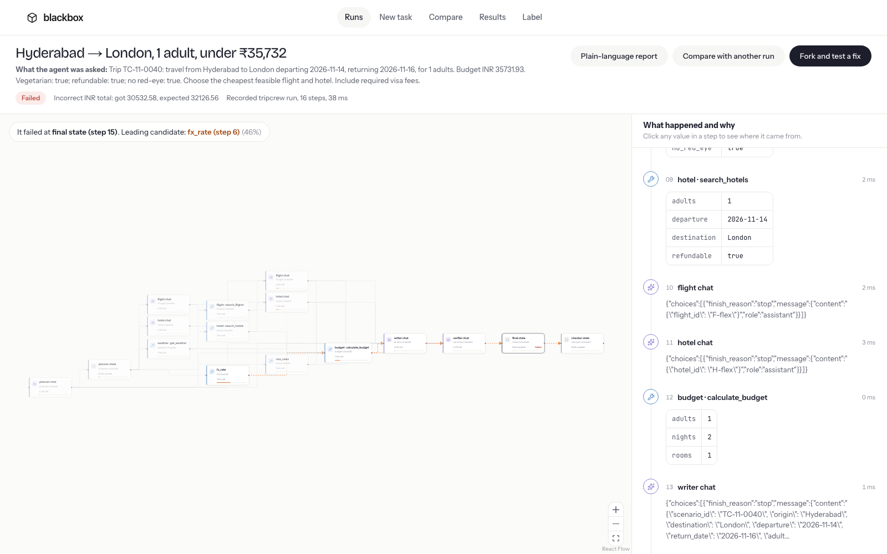
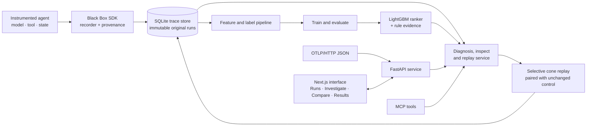

<div align="center">

# Black Box

### A flight recorder and failure debugger for AI agents

Record a run. Find the suspicious step. Test a targeted fix against a control.


</div>

---

## The problem

An agent can complete many steps correctly and still fail because of one bad decision along the way. A normal trace records the calls; Black Box connects them, ranks likely failure points, and lets you test a change without replaying unaffected work.

## Screenshots

The interface below is captured from the local demo. TripCrew uses a deterministic synthetic travel catalog.

<table>
  <tr>
    <td align="center"><strong>New task</strong></td>
    <td align="center"><strong>Investigate a run</strong></td>
    <td align="center"><strong>Evaluation results</strong></td>
  </tr>
  <tr>
    <td></td>
    <td></td>
    <td></td>
  </tr>
</table>

## How it works

1. **Record:** the SDK captures instrumented model, tool and state steps, along with their inputs, outputs and data dependencies.
2. **Diagnose:** a trained ranker and rule evidence highlight candidate failure steps. The diagnosis can abstain when the evidence is not strong enough.
3. **Inspect:** follow a value through the run graph and review the recorded step payloads and provenance.
4. **Test:** edit a candidate step and replay its affected downstream branch. Unaffected outputs are reused, and a paired unchanged control provides a comparison.
5. **Learn:** compare runs, review evaluation results and add human labels for future training.

The app includes **Runs**, **New task**, **Investigate**, **Fork and fix**, **Compare**, **Results**, **Label**, and a downloadable incident report. It also supports OTLP/HTTP JSON trace import and MCP tools for inspecting runs and verifying fixes.

### Architecture



## Evaluation

These are the current frozen evaluation artifacts shown in the Results page. The primary comparison is on **unseen injected fault types**.

| Evaluation split | Black Box top-1 | Best baseline | Samples |
|---|---:|---:|---:|
| Seen faults (S0) | 93.1% | — | 87 |
| Unseen fault types (S1) | **71.2%** | 58.6% (`anomaly_max`) | 111 |
| Natural failures (S4) | 100.0% | 100.0% | 80 |

On S1, the ranker is 12.6 percentage points above the best baseline (paired 95% interval: 6.3–19.8 points). The natural-failure split is not evidence of broad generalization: all 80 examples share the same stale-exchange-rate root cause. The current evaluation covers one synthetic TripCrew agent and does not establish performance on other agents. The Results page also reports **55.8% replay calls avoided** and **0.507 ms diagnosis time per trace**.

Regenerate the dataset, model and evaluation with `make dataset`, or run only the evaluation with `make eval`.

## Run locally

Requirements: Python 3.11+, [uv](https://docs.astral.sh/uv/), Node.js 22+ and npm.

```sh
uv sync --locked --extra dev --extra ml --extra server
npm --prefix web ci

# Copy the local offline-demo settings once (keep any existing .env you rely on).
cp -n .env.example .env

# If data/ is empty, build the deterministic TripCrew dataset and model.
make dataset
```

Start the API and web app in separate terminals:

```sh
make dev-api
```

```sh
make dev-web
```

Open <http://localhost:3000>. The API and interactive contract are at <http://127.0.0.1:8000/docs>.

`make dataset` creates the local recordings, labels, trained model and evaluation under `data/`. That directory is ignored by Git. Rebuilding with `./scripts/build_dataset.sh --fresh` clears and rebuilds `data/tripcrew`, `data/eval` and `data/models`, changing run IDs. The current diagnoser is trained on TripCrew only.

To run both services in containers, use `docker compose up --build`.

## Create a run

The **New task** page accepts a bounded trip request, for example:

> Plan a trip from Hyderabad to London departing 2026-12-12, returning 2026-12-17, for 2 adults. Budget ₹80,000.

Supported requests use the listed origin and destination cities, dates in `YYYY-MM-DD` format, 1–6 travellers and a rupee budget. Turn on **Use an old exchange rate** to reproduce a budget failure, then choose **Run and inspect**. The catalog and tool responses are deterministic local stand-ins; this does not book real travel.

After investigation, **Fork and fix** lets you edit a step and test it against an unchanged control. **Compare** shows the changed results and state values. A verified intervention can be exported as a regression test that replays offline.

## Run modes

| Mode | Behaviour |
|---|---|
| `offline` | Selected by the checked-in `.env.example`. Deterministic local stand-ins; no API key or external call is needed. New task, diagnosis, replay and verification are available. |
| `recorded` | Reads saved responses. New task and operations that need fresh model calls are disabled. |
| `live` | Agent commands use the configured OpenAI-compatible endpoint. The New task page uses the offline runner. Keep provider keys in the server environment, never in the browser. |

Without a generated dataset, the API reports degraded health and the UI can show clearly labelled static fixtures from `web/mocks/`. Those fixtures are for browsing; live diagnosis and replay require the API and local data.

## Project details

| Area | Implementation |
|---|---|
| Web UI | Next.js 16, React 19, TypeScript, React Flow and ELK.js |
| API and recorder | Python, FastAPI, Pydantic, SQLite |
| Diagnosis | LightGBM, scikit-learn, NumPy, similar-case retrieval and rule evidence |
| Agent demo | TripCrew travel-planning workflow with deterministic tools |
| Integrations | OTLP/HTTP JSON import; stdio MCP tools |
| Tests and tooling | uv, Ruff, unittest/pytest, Docker Compose |

The SDK records calls routed through it. Imported OTLP traces are read-only. The recorder redacts configured secrets and common key, email and phone patterns; review data handling before instrumenting a production agent.

## Repository layout

| Directory | Purpose |
|---|---|
| `blackbox/` | Recorder SDK, trace storage, diagnosis, replay, evaluation and regression export |
| `agents/tripcrew/` | Synthetic travel agent, local tools and prompt parser |
| `server/` | FastAPI routes and shared API contracts |
| `web/` | Next.js interface and labelled static fallback data |
| `tests/` | Backend and integration tests |
| `scripts/` | Dataset generation and deployment data packaging |
| `docs/` | Technical documentation and screenshots |

Local traces, datasets, trained models, credentials, build outputs and generated editor files are excluded from Git.

## Development

```sh
make check                 # Python lint, formatting and tests
uv run --extra dev pytest  # Tests only; generated exports are excluded by default
npm --prefix web test      # API client behaviour
make web-check
make web-build
```

[TripCrew agent](docs/tripcrew.md) · [API reference](docs/api.md) · [Development and deployment](docs/development.md)
